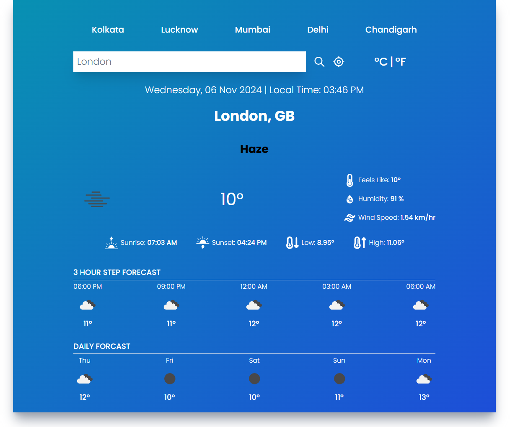
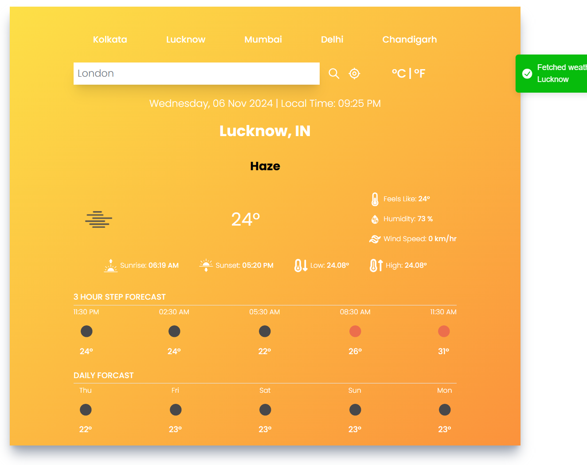
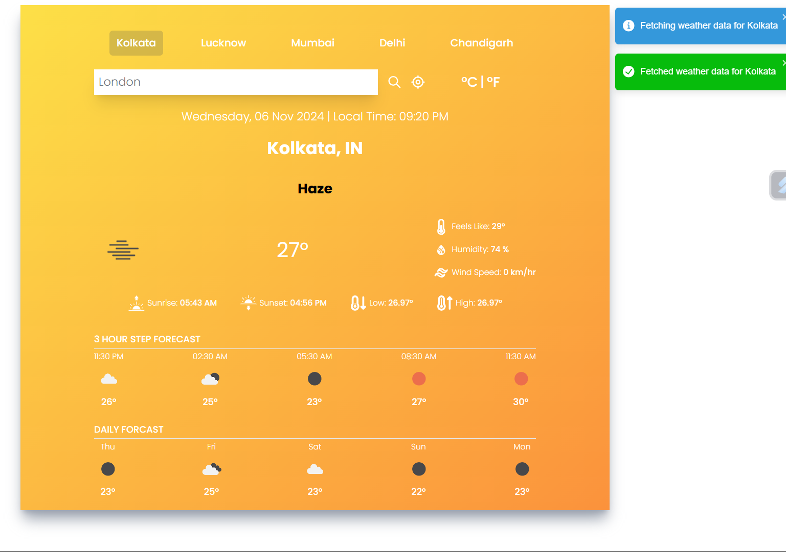

# Weather-App-Using-ReactJs

## Project Overview

The React Weather App is a web application designed to provide users with real-time weather information for any location worldwide. Built using React.js, this app leverages the OpenWeather API to fetch and display weather data, offering a seamless and interactive user experience. The project showcases the power of React in building dynamic and responsive web applications.

## Table of Contents

- Objective and Usage
- Technologies Used
- Features
- API Integration

## Objective

The React Weather App is a comprehensive project that demonstrates the practical application of
React.js in building a functional and responsive web application. By integrating with the OpenWeather API, the app provides real-time weather information, making it a valuable tool for users. The project highlights key React concepts such as state management, component-based architecture, and API integration.

The application will display the current weather conditions for the city, including temperature, humidity, pressure, and wind speed etc.

## Technologies Used

React.js: For building the user interface and project.  
 Javascript : For integrating the API and other functionalities.
OpenWeather API: To fetch weather data.
CSS: For styling the application.

## Features

- Real-time weather data retrieval from the Open Weather Map API.
- Displays comprehensive weather details such as temperature, humidity,sunrise, sunset, and wind speed etc.
- Clean and intuitive user interface.
- Responsive Design

## API Integration:

o The app uses the OpenWeather API to fetch weather data. An API key is required to authenticate requests.
o The API call is made using the fetch function, and the response is processed to extract relevant weather information.

# Here Are Some Previews

